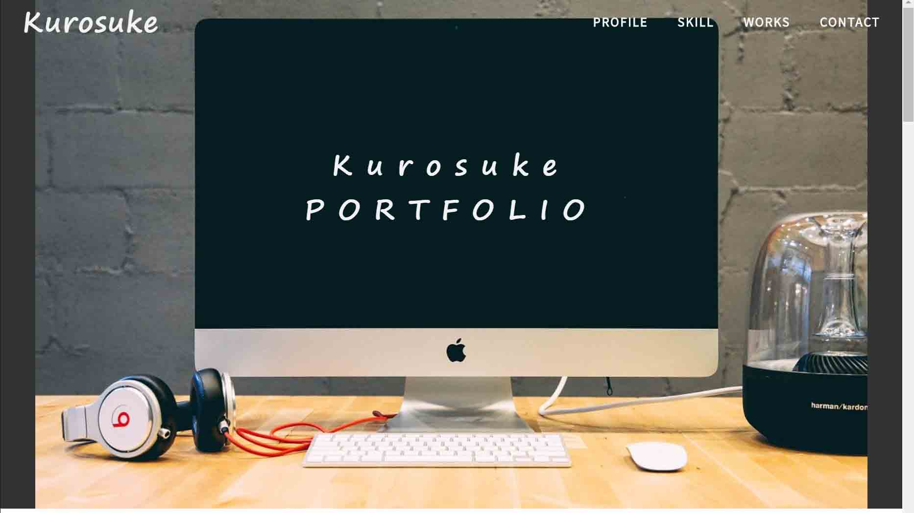

# ポートフォリオサイト
 
## アプリケーションの概要
 
くろすけのポートフォリオサイトです。
[デモページ](https://kurosuke-web.com/)

## 画面イメージ ##
 

 
## 機能と環境
 
- フロートヘッダーメニュー（javascript）
- スライダー（slick.js）
- ハンバーガーメニュー（javascript）
- スムーズスクロール（javascript）
- デモページ環境: Xsever
 
## 必要要件
 
- jquery: 3.5.0
- scss

## 作者

* 作成者：くろすけ
* Twitter：[@guroguro33](https://twitter.com/guroguro33)
 
## ライセンス
 
"portfolio" is under [MIT license](https://en.wikipedia.org/wiki/MIT_License).